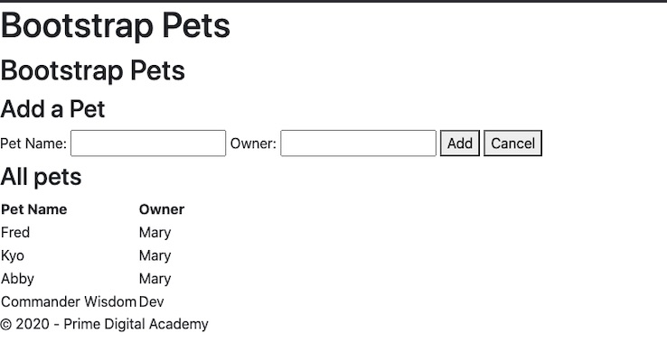
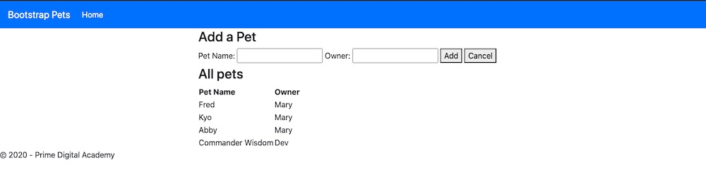
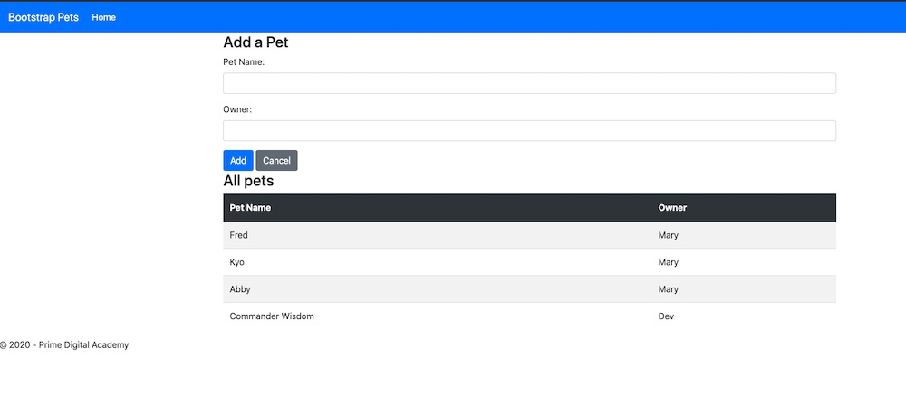

#Introduction to Bootstrap

This assignment should help you get a little practice with [Bootstrap](https://getbootstrap.com/)

## Add Bootstrap

First things first, get Bootstrap and add it into the project. 

Download the files, and source them in. Need help? Check out the [Download](https://getbootstrap.com/docs/4.5/getting-started/download/) Info.

> Note that without doing anything other than sourcing in the files, you should see the font style change on the page.

## Style it up!

Let's get things spiffed up spaced a little nicer by using the bootstrap header and a container.

- Let's add the [container](https://getbootstrap.com/docs/4.5/layout/overview/) first. Add the `container` style to the `main` element.
- In place of our existing `header` and `h1`, let's add the Bootstrap [navbar](https://getbootstrap.com/docs/4.5/components/navbar/). Make it either a dark or primary colored navbar. (Scroll down to color schemes to see how to do this.)

## Form & Table
Use the Bootstrap form style classes to improve the look of the form inputs, buttons and the pets table. 

### Form
- Use the `form-group` to group the lables and input fields. 
- Use a `primary` style button for the form 'Add' button & a `secondary` style for the 'Cancel'.

References:
- [Forms](https://getbootstrap.com/docs/4.5/components/forms/)
- [Buttons](https://getbootstrap.com/docs/4.5/components/buttons/)

### Table 

Make the table head dark and add zebra-stripping for the table rows.

Reference:
- [Tables](https://getbootstrap.com/docs/4.5/content/tables/)

## Add your own CSS

Using Bootstrap doesn't mean you can't have your own stylesheet and styles. 

Add your own `style.css` file after Bootstrap. Add CSS to give the `nav` and `section`s a bottom margin of `1rem`.

## Stretch Goals

### Images
There are some images in the `images` folder. See if you can add a new section with an image carousel. 

### Sticky Footer

Try to add a *Sticky Footer* using this layout example:
  https://getbootstrap.com/docs/4.5/examples/sticky-footer/

> Note you'll have to view the source in the browser to see what they did here.